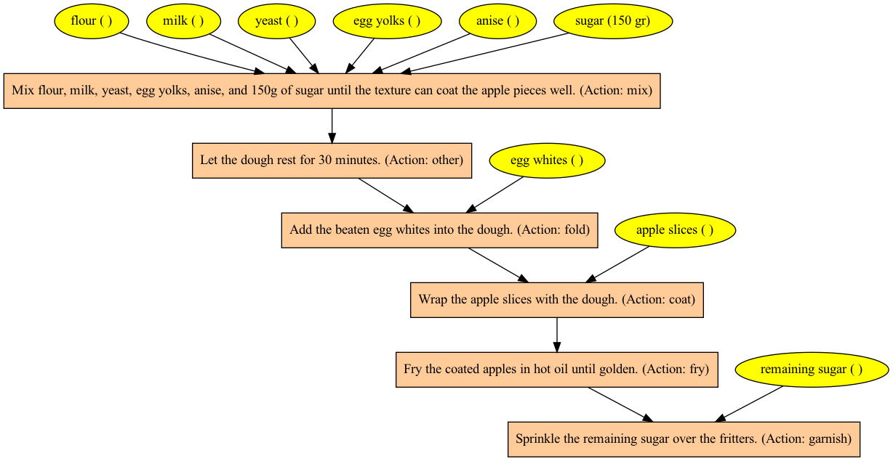

# Document parsing with GPT4  

Even after a year of being launched, GPT-4 doesn't cease to
amaze me. A task that would have been the subject of a PhD in NLP just
a few years ago, now achievable with pretty good reliability
with a carefully designed prompt.

Example: Parse an old catalan recipe into a Directed Acyclic Graph of 
ingredients and instructions following the provided [recipe.json](recipe.json) JSONSchema:

```
python parser.py recipe.json "Feu una pasta amb la farina, la llet, el llevat, els rovells d’ou, l’anís i 150 g de sucre, fins que tingui una textura que cobreixi bé els trossos de poma. Deixeu-la reposar 30 minuts. Afegiu-hi les clares a punt de neu. Emboliqueu les rodanxes de poma amb la pasta i fregiu-les amb abundant oli calent. Traieu els bunyols quan siguin rossos i tireu-hi pel damunt el sucre restant." 
```
should return something like this:
```json
{
 "name": "Bunyols",
 "language": "Catalan",
 "nodes": [
  {
   "id": "flour",
   "type": "ingredient",
   "name_en": "flour",
   "next_steps": [
    "mix_dough"
   ],
   "quantity": null,
   "quantity_unit": null,
   "compatible_diets": null,
   "allergens": [
    "gluten"
   ]
  },
  {
   "id": "milk",
   "type": "ingredient",
   "name_en": "milk",
   "next_steps": [
    "mix_dough"
   ],
   "quantity": null,
   "quantity_unit": null,
   "compatible_diets": [
    "vegetarian"
   ],
   "allergens": [
    "dairy"
   ]
  },
  {
   "id": "yeast",
   "type": "ingredient",
   "name_en": "yeast",
   "next_steps": [
    "mix_dough"
   ],
   "quantity": null,
   "quantity_unit": null,
   "compatible_diets": null,
   "allergens": null
  },
  {
   "id": "egg_yolks",
   "type": "ingredient",
   "name_en": "egg yolks",
   "next_steps": [
    "mix_dough"
   ],
   "quantity": null,
   "quantity_unit": null,
   "compatible_diets": [
    "vegetarian"
   ],
   "allergens": [
    "egg"
   ]
  },
  {
   "id": "anise",
   "type": "ingredient",
   "name_en": "anise",
   "next_steps": [
    "mix_dough"
   ],
   "quantity": null,
   "quantity_unit": null,
   "compatible_diets": null,
   "allergens": null
  },
  {
   "id": "sugar150",
   "type": "ingredient",
   "name_en": "sugar",
   "next_steps": [
    "mix_dough"
   ],
   "quantity": 150,
   "quantity_unit": "gr",
   "compatible_diets": [
    "vegan"
   ],
   "allergens": null
  },
  {
   "id": "mix_dough",
   "type": "step",
   "description": "Mix flour, milk, yeast, egg yolks, anise, and 150g of sugar until the texture can coat the apple pieces well.",
   "description_raw": "Make a dough with the flour, milk, yeast, egg yolks, anise, and 150 g of sugar, until it has a texture that coats the apple pieces well.",
   "action": "mix",
   "next_steps": [
    "rest_dough"
   ],
   "duration": null
  },
  {
   "id": "rest_dough",
   "type": "step",
   "description": "Let the dough rest for 30 minutes.",
   "description_raw": "Let it rest for 30 minutes.",
   "action": "other",
   "next_steps": [
    "add_egg_whites"
   ],
   "duration": 30
  },
  {
   "id": "egg_whites",
   "type": "ingredient",
   "name_en": "egg whites",
   "next_steps": [
    "add_egg_whites"
   ],
   "quantity": null,
   "quantity_unit": null,
   "compatible_diets": [
    "vegetarian"
   ],
   "allergens": [
    "egg"
   ]
  },
  {
   "id": "add_egg_whites",
   "type": "step",
   "description": "Add the beaten egg whites into the dough.",
   "description_raw": "Add the egg whites beaten to stiff peaks.",
   "action": "fold",
   "next_steps": [
    "coat_apples"
   ],
   "duration": null
  },
  {
   "id": "apple_slices",
   "type": "ingredient",
   "name_en": "apple slices",
   "next_steps": [
    "coat_apples"
   ],
   "quantity": null,
   "quantity_unit": null,
   "compatible_diets": null,
   "allergens": null
  },
  {
   "id": "coat_apples",
   "type": "step",
   "description": "Wrap the apple slices with the dough.",
   "description_raw": "Wrap the apple slices with the dough.",
   "action": "coat",
   "next_steps": [
    "fry_apples"
   ],
   "duration": null
  },
  {
   "id": "fry_apples",
   "type": "step",
   "description": "Fry the coated apples in hot oil until golden.",
   "description_raw": "Fry them in hot oil.",
   "action": "fry",
   "next_steps": [
    "sprinkle_sugar"
   ],
   "duration": null
  },
  {
   "id": "sugar_remainder",
   "type": "ingredient",
   "name_en": "remaining sugar",
   "next_steps": [
    "sprinkle_sugar"
   ],
   "quantity": null,
   "quantity_unit": null,
   "compatible_diets": [
    "vegan"
   ],
   "allergens": null
  },
  {
   "id": "sprinkle_sugar",
   "type": "step",
   "description": "Sprinkle the remaining sugar over the fritters.",
   "description_raw": "Sprinkle the remaining sugar over them.",
   "action": "garnish",
   "next_steps": null,
   "duration": null
  }
 ]
}
```
Now run the viz tool to convert into a nicely ordered DAG visualization:
```
python viz.py parsed_recipe.json 
```
To obtain a PNG image like this:


